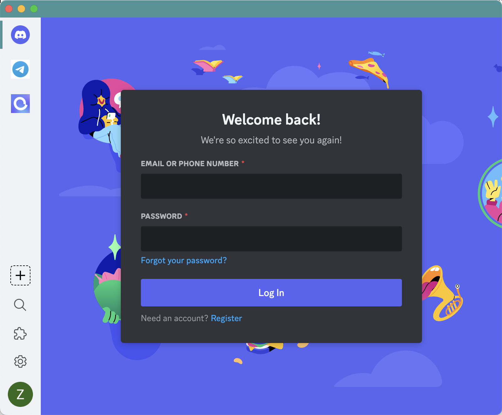
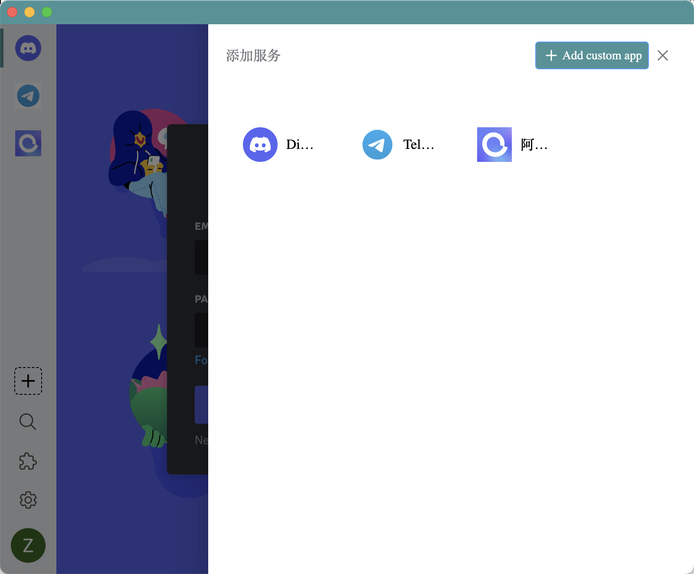
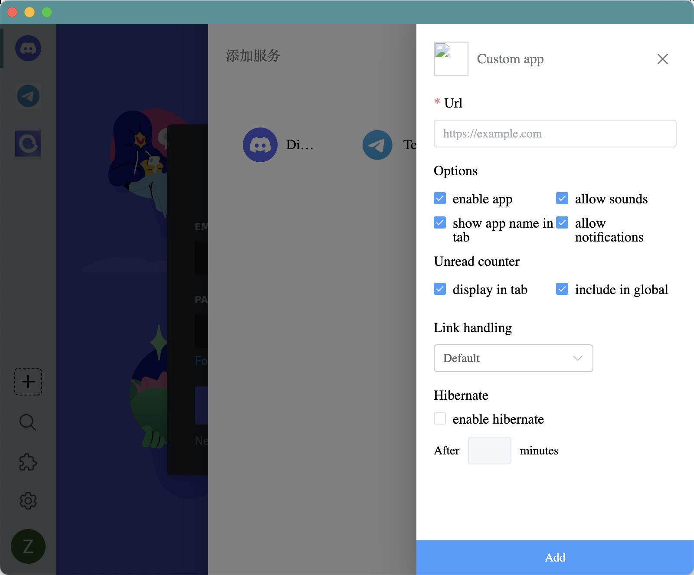
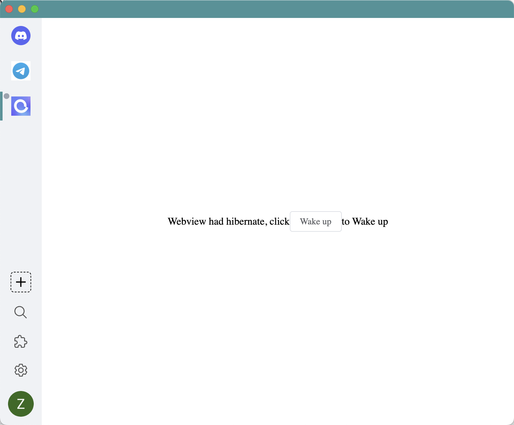

<h1 align="center">
  AllInOne
   
</h1>

## Screenshot

### Add Service

### Add Custom Service

### Hibernate Service

## Services available
<string>In process</string>
 

## back
[allInBoxBack](https://github.com/luke358/allInBoxBack)

## TODO

- [x] services store
- [x] service configuration
- [x] hibernation service
- [x] wake up service
- [x] add custom service
- [ ] global setting
- [ ] search local service
- [ ] backend service
- [ ] search remote service
- [ ] persistent Data
- [ ] 宫格聚合

## Features

License
-------------------
MIT